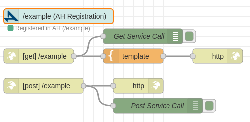
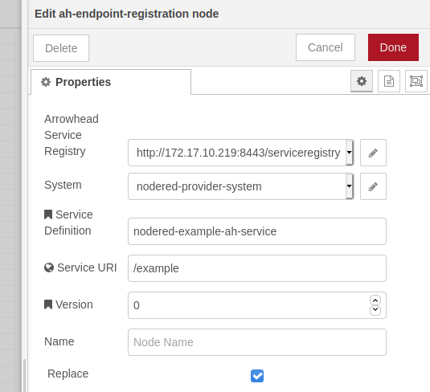
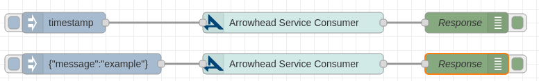
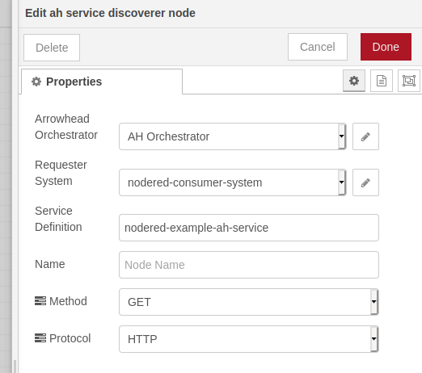
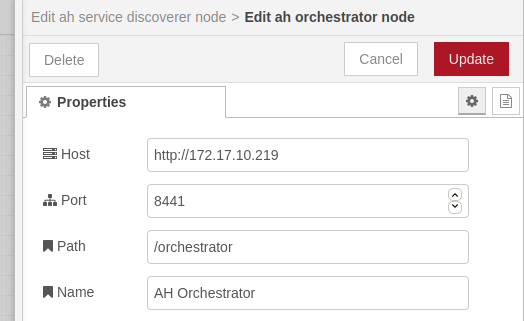
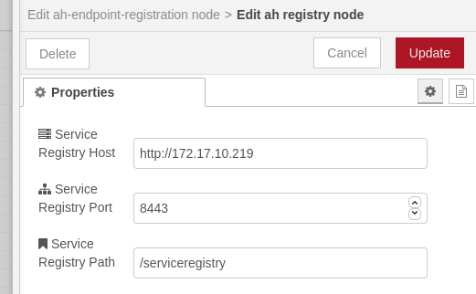
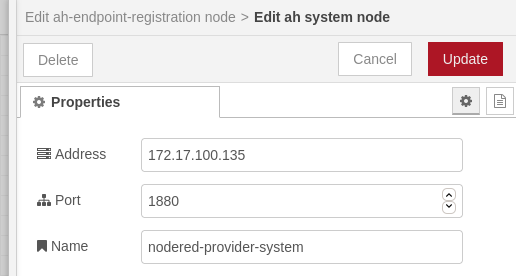

# Node-RED Arrowhead framework nodes

A collection of nodes for [Node-RED](http://nodered.org) related to [Arrowhead Framework](https://www.arrowhead.eu/arrowheadframework).

## 1. Nodes and explaination

There are several nodes in this repository in order to connect with ```Arrowhead Framework```:

### 1.1 Regular nodes

#### 1.1.1 AH Service Endpoint

This node is used to register an endpoint in an ```Arrowhead Registry```.

| | |
|---|---|
|   |   |
| *Arrowhead Service Endpoint node* | *Arrowhead Service Endpoint node configuration.* |

#### 1.1.2 AH Service Discovery

This node gets an ```Arrowhead Service``` from ```Arrowhead Orchestrator``` and calls it.

| | |
|---|---|
|  |  |
| *Arrowhead Service Discoverer node* | *Arrowhead Service Discoverer node configuration.*  |

### 1.2 Configuration nodes

#### 1.2.1 AH Orchestrator

Used to stablish where the ```Arrowhead Orchestrator``` can be found.

| |
|---|
|  |
|*Arrowhead Orchestrator configuration node.* |

#### 1.2.2 AH registry

Used to stablish where the ```Arrowhead Registry``` can be found.

| |
|---|
|  |
|*Arrowhead Registry configuration node.* |

#### 1.2.3 AH System

Used to register ```Arrowhead``` systems (e.g. register NodeRed instance as a consumer).

| |
|---|
| |
| *Arrowhead System configuration node.* |

## 2. Under development

The nodes are under development at this moment. No security configuration works yet.

## 3. Docker image to try it

You can test the module using docker and a node-red image.

This commands will remove (if exists) the old container, build a new image and run a new container with ```node-red-contrib-arrowhead``` installed.

- Remove old image:

```console
docker stop ah_node-red
docker rm ah_node-red
```

- Build image:

```console
docker build --tag ah_node-red:latest .
```

- Run:

```console
docker run --publish 1880:1880 --detach --name ah_node-red ah_node-red:latest
```

- It will be abailable at [http://localhost:1880](http://localhost:1880).