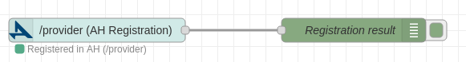
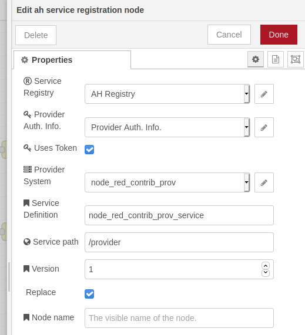
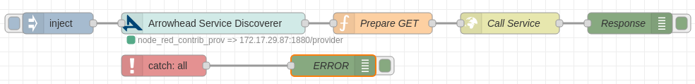
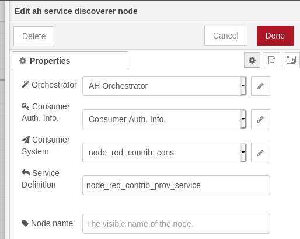
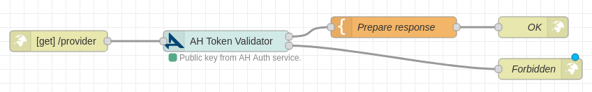
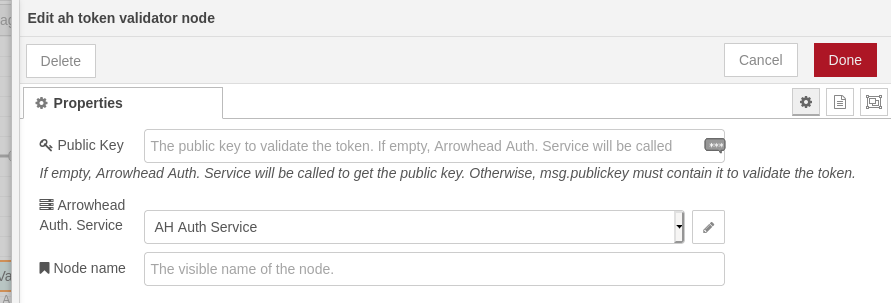
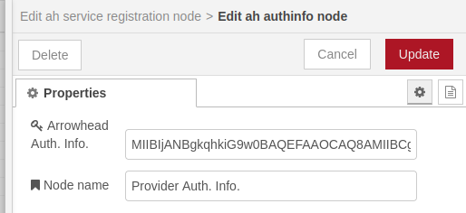
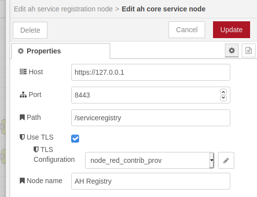
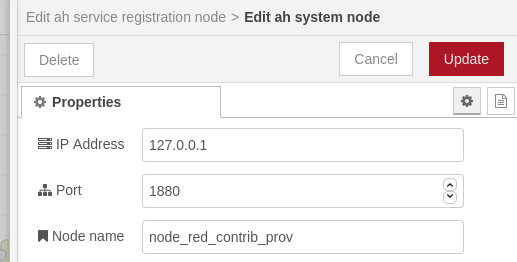

# Node-RED Arrowhead framework nodes

A collection of nodes for [Node-RED](http://nodered.org) related to [Arrowhead Framework](https://www.arrowhead.eu/arrowheadframework).

## 1. Nodes and explaination

There are several nodes in this repository in order to connect with ```Arrowhead Framework```:

### 1.1 Regular nodes

This are nodes that can be drag & dropped to flows.

#### 1.1.1 AH Service Registration

This node is used to register a service (e.g. REST endpoint) to an ```Arrowhead Registry```.

| | |
|---|---|
|   |   |
| *Arrowhead Service Registration node* | *Arrowhead Service Registration node configuration.* |

#### 1.1.2 AH Service Discoverer

This node asks ```Arrowhead Orchestrator``` for an ```Arrowhead Service```.

| | |
|---|---|
|  |  |
| *Arrowhead Service Discoverer node* | *Arrowhead Service Discoverer node configuration.*  |

#### 1.1.3 AH Token Validator

This node validates an *Arrowhead Token*. You must configure an *Arrowhead Authorization Service*. It will be used to download a public key on deploy. As an alternative, the public key can be directly added in the node configuration.

When an input message arrives, it will validate the token in ```msg.token``` or ```msg.req.headers.authorization```.

Due to the use of ```crypto.createPublicKey```, this node is not compatible with ```Node.js <= 10```.

| | |
|---|---|
|  |  |
| *Arrowhead Token Validator node.* | *Arrowhead Token Validator node configuration.*  |

### 1.2 Configuration nodes

This are configuration nodes that can be reused.

#### 1.2.1 AH Authentication Info.

Use to stablish authentication information for arrowhead systems. This will authenticate the provider/consumer systems.

| |
|---|
|  |
|*Arrowhead Authentication Info. configuration node.* |


#### 1.2.2 AH Core Service

Used to stablish where ```Arrowhead Core Systems``` can be found (e.g. Authorization, Orchestrator, Registry...).

| |
|---|
|  |
|*Arrowhead Core Service configuration node.* |

#### 1.2.3 AH System

Used to register ```Arrowhead``` systems (e.g. register NodeRed instance as a consumer).

| |
|---|
| |
| *Arrowhead System configuration node.* |


## 2. Under development

The nodes are under development at this moment. Many functionalities may be developed for specific use-cases and not fully compatible for all scenarios yet.


## Authoring

Developed at [Mondragon Unibertsitatea](https://www.mondragon.edu/) during the participation of the European project [**Arrowhead Tools**](https://www.arrowhead.eu/arrowheadtools).

Main developers:
- [Alain Perez Riaño](https://www.mondragon.edu/en/bachelor-degree-computer-engineering/lecturers/-/profesor/alain-perez-riano)
- [Felix Larrinaga Barrenechea](https://www.mondragon.edu/en/bachelor-degree-computer-engineering/lecturers/-/profesor/felix-larrinaga-barrenechea)
- William Steven Ochoa Agurto